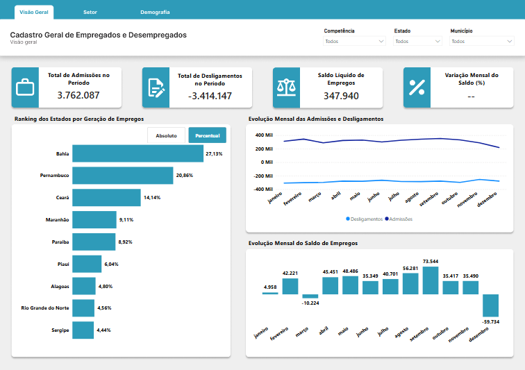
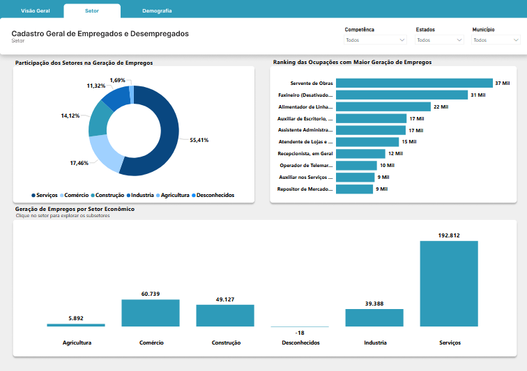
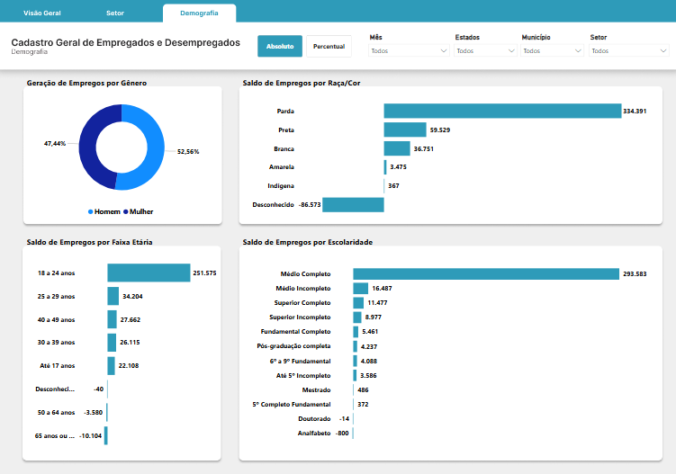

# Análise do Mercado de Trabalho no Nordeste — Novo CAGED

Este projeto tem como objetivo analisar a dinâmica do mercado de trabalho formal na região Nordeste do Brasil, utilizando os microdados oficiais do **Novo CAGED**, por meio de um pipeline completo de dados (ETL) e visualização analítica em **Power BI**.

O projeto percorre todas as etapas de um fluxo de dados: **extração, transformação, carga, modelagem e visualização**, transformando dados brutos em **informação estratégica para apoio à tomada de decisão**.

---

## Objetivo

Construir uma solução analítica que permita:

* Monitorar admissões, desligamentos e saldo de empregos;
* Analisar a evolução temporal do mercado de trabalho;
* Comparar o desempenho dos estados do Nordeste;
* Investigar padrões setoriais e demográficos;
* Gerar insights estratégicos sobre o comportamento do emprego formal na região.

---

## Arquitetura da Solução

O pipeline de dados foi estruturado em três principais camadas:

```
FTP (Novo CAGED)
     ↓
Python ETL (Pandas, SQLAlchemy)
     ↓
PostgreSQL (Data Warehouse)
     ↓
Power BI (Dashboard)
```

### Fluxo Geral:

1. Extração dos microdados do Novo CAGED via FTP;
2. Tratamento, limpeza e padronização em Python;
3. Armazenamento em banco de dados PostgreSQL;
4. Modelagem analítica;
5. Visualização interativa no Power BI.

---

## Ferramentas Utilizadas

* **Python** — Extração (Via FTP), tratamento e automação do pipeline (ETL)
* **Pandas & NumPy** — Manipulação e transformação de dados
* **SQL & PostgreSQL** — Armazenamento e organização da base
* **Power BI** — Modelagem analítica, visualização e dashboard interativo

---

## Estrutura do Pipeline ETL (`etl_caged.py`)

O script `etl_caged.py` implementa um pipeline completo de ETL (Extract, Transform, Load) para coleta, tratamento e armazenamento dos microdados do Novo CAGED no PostgreSQL. O processo é dividido em 6 etapas principais:

### 1. Configuração inicial

Nesta etapa são definidas as variáveis de controle do ETL:
* **ano_atual**: ano da competência a ser processada
* **competencia**: mês da competência
* **ano_filtro**: lista de anos considerados válidos
* **engine_sql**: string de conexão com o PostgreSQL

### 2. Extração dos dados (Extract)

O script conecta-se ao servidor FTP do Ministério do Trabalho:
```bash
ftp.mtps.gov.br/pdet/microdados/NOVO CAGED/
```
São baixados três arquivos principais:
* **CAGEDMOV** - Movimentações mensais
* **CAGEDFOR** - Movimentações fora do prazo
* **CAGEDEXC** - Exclusões e ajustes
Os arquivos são baixados no formato `.7z`.

### 3. Descompactação

Os arquivos `.7z` são extraídos automaticamente utilizando a biblioteca `py7zr`, gerando arquivos `.txt` contendo os microdados.

### 4. Transformação dos dados (Transform)

Esta é a etapa mais importante do pipeline, onde os dados são tratados e padronizados. Ela se divide em:
* Leitura dos arquivos `.txt`
* Criação e conversão de colunas
* Filtro geográfico: `Nordeste`
* Tradução de códigos para valores descritivos
* Criação de variáveis derivadas
* Padronização dos nomes das colunas
* União dos dados (`CAGEDMOV` + `CAGEDFOR`)

### 5. Carga no banco de dados (Load)

O script conecta-se ao PostgreSQL utilizando `SQLAlchemy`. Esta etapa segue o seguinte processo:
* Cria tabela temporária para processar o arquivo `CAGEDEXC`
* Identifica os registros inválidos e remove da tabela principal (`ft_caged`)
* Exclui tabela temporária
* Os dados tratados (`CAGEDMOV` + `CAGEDFOR`) são inseridos na tabela principal

### 6. Limpeza dos arquivos baixados

Após a carga no banco, os arquivos baixados (`CAGEDMOV`, `CAGEDFOR` e `CAGEDEXC`) são removidos automaticamente para evitar acúmulo desnecessário de dados:
* Arquivos `.7z`
* Arquivos `.txt`

---
## Exclusão das informações (CAGEDEXC)

Um dos principais desafios dos microdados do Novo CAGED é processar o arquivo de "Desconsiderados" sem possuir identificadores únicos, como o CPF, na base pública.
Nesse sentido, para ultrapassar essa barreira, foi preciso utilizar uma CTE (Common Table Expression) no postgreSQL que possibilitasse a numeração das ocorrências duplicadas na tabela principal e a numeração das solicitações de exclusões contidas no arquivo **CAGEDEXC** para que realizasse um 'match' exato entre as ocorrências e deletasse apenas a quantidade solicitada, preservando os dados legítimos. Essa etapa foi implementada ao `etl_caged.py`

### Script:

```bash
sql excluir_cagedexc.sql
```
---
## Banco de Dados — PostgreSQL

O PostgreSQL é utilizado como **camada central de armazenamento**, permitindo:

* Persistência dos dados históricos;
* Atualizações e ajustes incrementais;
* Organização estruturada da base;
* Integração direta com o Power BI.

## Arquitetura do Banco

**Tabela fato:**
* `ft_caged`

**Principais campos:**
* data_competencia
* ano
* mes
* regiao
* uf
* municipio
* secao
* saldo_movimentacao
* instrucao
* idade
* raca_cor
* sexo
* cbo
* setor
* faixa_etaria

---

## Dashboard — Power BI

O dashboard foi desenvolvido para transformar os dados tratados em **insights estratégicos**, permitindo uma análise clara, dinâmica e interativa do mercado de trabalho formal no Nordeste.

### Visão Geral



### Análise Setorial



### Análise Demográfica



🔗 **Dashboard:**
[Clique aqui](https://app.powerbi.com/view?r=eyJrIjoiZjc3MGYwNTUtOTkwNy00ZGNjLWEwZjEtNWI1ODVkMDNkNWRkIiwidCI6ImUyZjc3ZDAwLTAxNjMtNGNmNi05MmIwLTQ4NGJhZmY5ZGY3ZCJ9)

---
## Estrutura do Repositório

```
pipeline - caged - nordeste
│
├── docs/
│   ├── dashboard_geral.png
│   ├── dashboard_setor.png
│   └── dashboard_demografia.png
│
├── etl/
│   └── etl_caged.py
│
├── sql/
│   └── create_database.sql
│   └── create_table_caged.sql
│   └── delete_cagedexc.sql
│
├── auxiliary/
│   └── muni.xlsx
│   └── cbo.xlsx
|
├── README.md
└── requirements.txt
```

---

##  Como Executar o Projeto

### 1. Clonar o repositório

```bash
git clone https://github.com/seu-usuario/caged-nordeste-analytics.git
```

### 2. Instalar dependências

```bash
pip install -r requirements.txt
```
### 3. Criar banco de dados

```bash
psql -U postgres -f sql/create_database.sql
```

### 4. Criar tabela 

```bash
psql -U postgres -d projeto_caged -f sql/create_table_caged.sql
```

### 5. Executar pipeline

```bash
python etl/etl_caged.py
```

---
## Observações

* Os dados são provenientes de fonte pública oficial ([Novo CAGED](https://www.gov.br/trabalho-e-emprego/pt-br/assuntos/estatisticas-trabalho/microdados-rais-e-caged)).
* O projeto foi desenvolvido para fins educacionais, portfólio e aprimoramento técnico.
* Alguns comandos referente ao SQL foram implementados no `etl_caged.py` utilizando-se da função `text`.
* As variáveis de controle devem ser alteradas.

---
## Autor

**Wellington Mariano Pedro**

Estudante de Ciências Econômicas — UFPE

Foco em Data Analytics e Business Intelligence.

Linkedin: [https://linkedin.com/in/wellington-mariano](https://www.linkedin.com/in/wellington-mariano-985a39231/)

GitHub: [https://github.com/Well-Mariano](https://github.com/Well-Mariano)

---
## Licença

Este projeto está licenciado sob a Licença MIT. Veja o arquivo [LICENSE](LICENSE) para mais detalhes.

---
## Considerações Finais

Este projeto demonstra a construção de uma solução analítica completa, indo desde a ingestão automatizada dos dados até a geração de insights estratégicos por meio de dashboards interativos.

Se este projeto foi útil, sinta-se à vontade para deixar uma ⭐ no repositório.
